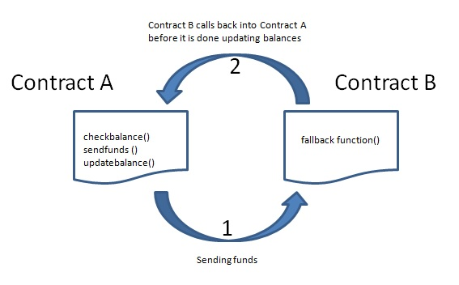
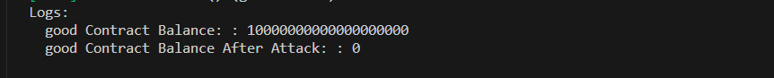
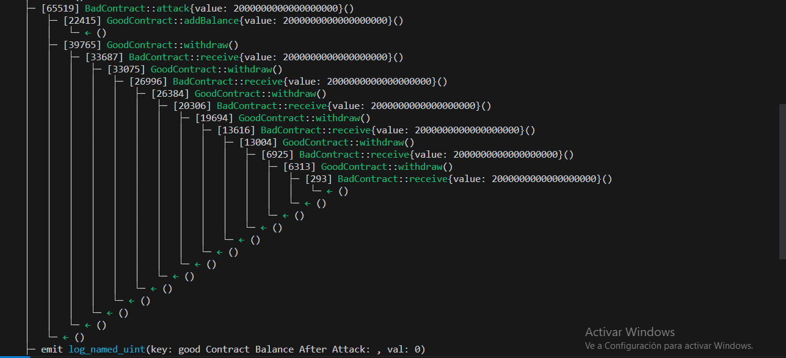

<h1 aling="center">Reentrancy attack with foundry test 📚⛓✨</h1>
  <a href="https://github.com/catellaTech" target="_blank">
    
  </a>
<br>
<br>

Re-Entrancy is one of the oldest security vulnerabilities that was discovered in smart contracts. It is the exact vulnerability that caused the infamous 'DAO Hack' of 2016. Over 3.6 million ETH was stolen in the hack, which today is worth billions of dollars. 📚🔓

## 👀 What is Re-Entrancy?


Re-Entrancy is the vulnerability in which if `Contract A` calls a function in `Contract B`, `Contract B` can then call back into `Contract A` while `Contract A` is still processing.

This can lead to some serious vulnerabilities in Smart contracts, often creating the possibility of draining funds from a contract.

Let's understand how this works with the example shown in the above diagram. Let's say `Contract A` has some function - call it `f()` that does 3 things:

- Checks the balance of ETH deposited into `Contract A` by `Contract B`
Sends the ETH back to `Contract B`
- Updates the balance of `Contract B` to 0
- Since the balance gets updated after the ETH has been sent, `Contract B` can do some tricky stuff here. If `Contract B` was to create a `fallback()` or `receive()` function in it's contract, which would execute when it received ETH, it could call `f()` in `Contract A` again.

Since `Contract A` hasn't yet updated the balance of `Contract B` to be 0 at that point, it would send ETH to `Contract B` again - and herein lies the exploit, and `Contract B` could keep doing this until `Contract A` was completely out of ETH.

## ⚒️ Let's Build
We will create a couple of smart contracts, `GoodContract` and `BadContract` to demonstrate this behaviour. `BadContract` will be able to drain all the ETH out from `GoodContract`. 

The main idea of this project was to practice Foundry and its most basic commands for testing with Solidity. 

🚨Note: One of the commands that helped us detect errors faster with -v (verbosity).

Verbosity of the EVM.

Pass multiple times to increase the verbosity (e.g. -v, -vv, -vvv).

Verbosity levels:

- 2: Print logs for all tests
- 3: Print execution traces for failing tests
- 4: Print execution traces for all tests, and setup traces for failing tests
- 5: Print execution and setup traces for all tests.
But you can only run the test, because we config in `foundry.toml` file the verbosity.

##  🔐 How to prevent this type of attack
- Use the `Check - Effect - Interact` pattern in your external/public functions. 
- Or make use of the [ReentrancyGuard](https://github.com/OpenZeppelin/openzeppelin-contracts/blob/master/contracts/security/ReentrancyGuard.sol) contract that openZeppelin provides us.

<hr>
<h2> Installing / Getting started </h2>

```bash
# Clone this project
$ git clone https://github.com/catellaTech/REENTRANCY-ATTACK-FONUDRY

# Access
$ cd REENTRANCY-ATTACK-FONUDRY

# Install dependencies
$ forge install
``` 
- Follow the [instructions](https://book.getfoundry.sh/getting-started/installation.html) to install [Foundry](https://github.com/foundry-rs/foundry).

<h2>Commands</h2>

- $ `forge build`
- $ `forge test`

<h2>Preview</h2>




<h2> Technologies / Built With </h2>

- Solidity
- Foundry

<h2>License</h2>

<p>This project is under license from MIT. For more details, see the LICENSE file.</p>

<h2>Contributing</h2>
Contributions are always welcome! Open a PR or an issue!

<br>
<br>

<p align="center">
<a href="mailto:catellatech@gmail.com" target="_blank" >
  
</a> 
<br/>
  Made with ❤️ by <b>catellaTech</b>.
<p/>
